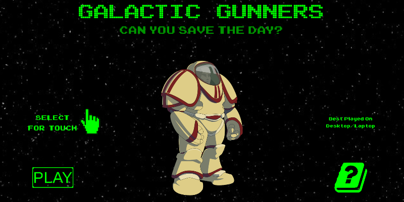
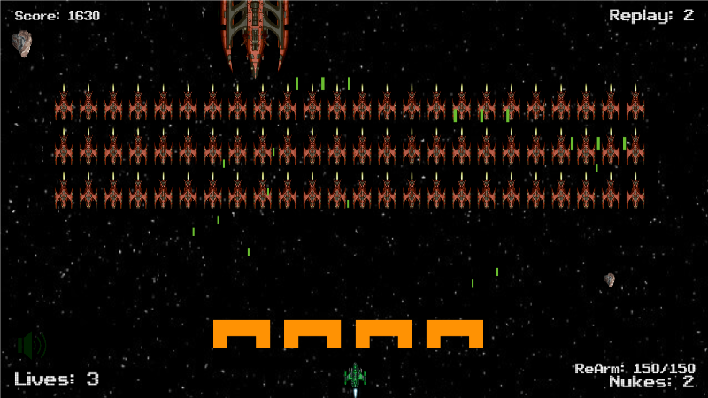

# GALACTIC GUNNERS #

###### Second Milestone Project - Interactive Frontend Development ######

This is my Space Invaders Style Game that I created for all ages. The game consists of a Main Menu with Info Page, 3 Levels, Pause Screen and Victory and Titles Page.
The game is responsive and incorporates a selector for those that are playing on touch screen devices, although the game is primarily to be played for best results on the Desktop or Laptop, which is mentioned on the Main Menu Screen.

## Demo ##

A deployed version of the game can be played [here](https://michael-leese.github.io/second_milestone_project/).

## UX ##

My objective for this game was to create a fun and challenging game, based in part on the original Space Invaders.  
My goal for the design was to modernise the original, adding better graphics and more interactivity between the player and their surroundings, with added features not included on the original game.  
The design utilises a star background for the feeling of being in space and green colours highlighting the alien theme.  

For Players I wanted a game that started off easy and progressed getting harder through the levels, with the ability of pausing should they need a break.

The Players should be able to intuitively navigate through the game, with clear instructions and easy to use controls, along with a background story that helps to set the scene of the game.

The game should be responsive, although for best user experience Desktop/Laptop is advised and should be clearly identified at the main menu.

## Technologies ##

Used | Leave Blank       
       ---------- | ----------
HTML5 | CSS3
Javascript ES6 | MarkDown
Bash | Ubuntu
GIT | GitHub
Cloud9 | VS Code
GIMP 2.10.10 | Jasmine Framework
[Phaser3](https://phaser.io) API | [phasergames.com](https://phasergames.com) (Utils API)
Chrome | web-server-for-chrome
FireFox | Microsoft Edge
Safari | Android Device
IoS Device | Windows LapTop
Chrome devTools inc Remote Device Debug | mybrowseraddon.com useragent-switcher
https://compresspng.com | https://tinypng.com

I have used the technologies above to build the game, create animations, view/play the game and test the game and code, as well as commit it to GitHub for deployment.

## Features ##

The site is written in Javscript and is playable on all devices sizes, although, as mentioned on the Main Menu Screen it is best played on the Laptop/Desktop. The game is fully responsive to the viewport. 

The game has provision for turning on or off the touch control ability.

#### Features left to implement ####

In the future, I would like to add the ability of storing and displaying the highscore, no matter who plays it and from any device.

## Testing ##

[Testing Documentation](testing/tests.md)

## Deployment ##

## Credits ##

#### Content ####

#### Media ####

#### Acknowledgements ####

